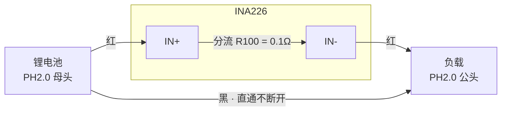
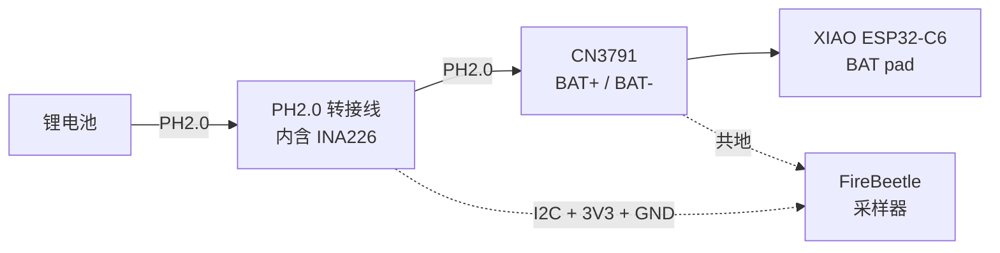
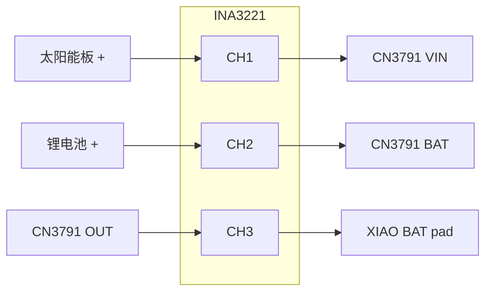

# 电流测量（INA226 / INA3221 + FireBeetle）

用 DFRobot FireBeetle 2 ESP32-C6 当采样器，读 INA226/INA3221，串口吐 CSV。
解决的问题：**idle 电流到底是多少**——在此之前只能靠 vbat LUT 反推，
而 2026-08-16 的教训是 LUT 中下段偏差 5–8%，平台段几小时不动，反推出来的
16.5 mA 不可信。

固件：`tools/ina-sampler/`　上位机：`tools/ina_log.py`

> 图用 Mermaid（GitHub 网页/手机端原生渲染），**照着焊请看表格**——
> 表格能逐行核对，图只用来理解结构。

---

## 接法 A：主控电池电流（INA226）

**高边分流**——分流电阻串在电池正极侧。

### 先做一根 PH2.0 转接线（一次做好，两边通用）

本项目全链路都是 JST-PH 2.0（电池、CN3791 模块都是），所以**不要剪电池线**，
拿一根 **PH2.0 公母对插延长线**改造成带分流的转接线，可反复插拔：



**`IN+` 朝电池、`IN-` 朝负载**。接反了电流符号相反（放电显示负值），
数值仍对，但和文档里的约定不一致。

这一根线：现在插在 FireBeetle 和它的 LiPo 之间自测，基线测试结束后
原样挪到主控的电池 ↔ CN3791 之间，不用重焊。

### 焊接清单（INA226）

| # | 从 | 到 | 说明 |
|---|---|---|---|
| 1 | 转接线红线 · 电池侧 | INA226 `IN+` | 方向别接反 |
| 2 | 转接线红线 · 负载侧 | INA226 `IN-` | |
| 3 | INA226 `VBS` | INA226 `IN-` | **板上这两点不通，必须飞一根短线** |
| 4 | FireBeetle `3V3` | INA226 `VCC` | 采样芯片供电 |
| 5 | FireBeetle `GND` | INA226 `GND` | |
| 6 | FireBeetle `SDA` | INA226 `SDA` | 正面 `SDA SCL GND 3V3` 那排焊盘，= GPIO19 |
| 7 | FireBeetle `SCL` | INA226 `SCL` | = GPIO20 |
| — | 转接线黑线 | 直通，不断开 | 两端 PH2.0 之间原样连着 |
| — | INA226 `ALE` | 不接 | 告警脚，用不上 |

`VBS` = 总线电压检测脚。**不焊它电流照样准，只有电压读数是垃圾**——但接上就能和主控
ADC 交叉标定（用来验证那个"ADC 偏低 80 mV"的疑点），所以顺手焊上。

### 接到主控时的全链路



FireBeetle 自己用板载 LiPo 或 USB 供电都行；USB 插电脑才能收 CSV。
测 idle 时太阳能要断开，否则量到的是净流。

**为什么高边不用低边**：低边（串在 GND 侧）只要主控 USB 一插，地就通过电脑
和 FireBeetle 连通，分流电阻被旁路，读数直接失效。高边不受影响，而且分流在
正极时电流是**有符号**的——放电为正、充电为负，同一套接线既能测 idle 也能
测充电电流。

**0.1 Ω 分流的压降**：idle 16 mA → 1.6 mV，电机 500 mA → 50 mV。都可以忽略，
不像早先设想的 10 Ω 方案那样测电机会把电压拉穿。**一套接线测全工况。**

---

## 接法 B：太阳能收支（INA3221）

三通道各有独立分流，一次看清"面板给多少、电池进出多少、主控吃多少"，
直接回答"太阳能补多少安才能循环"。



### 焊接清单（INA3221）

| # | 从 | 到 | 说明 |
|---|---|---|---|
| 1 | 太阳能板 + | `1IN+` → `1IN-` → CN3791 VIN | ch1 = 面板输出 |
| 2 | 锂电池 + | `2IN+` → `2IN-` → CN3791 BAT | ch2 = 电池净流 |
| 3 | CN3791 OUT | `3IN+` → `3IN-` → 主控 | ch3 = 负载 |
| 4 | FireBeetle `3V3` | INA3221 **`VS`** | **黑板电源脚叫 VS，不是 VCC** |
| 5 | FireBeetle `GND` | INA3221 `GND` | 所有 (−) 必须共地 |
| 6 | FireBeetle `SDA` | INA3221 `SDA` | |
| 7 | FireBeetle `SCL` | INA3221 `SCL` | |
| — | `VPU` / `A0` | 不接 | 告警上拉 / 地址选择，用不上 |

ch2 读数符号即净流向：**正 = 电池在放电，负 = 在充电**。
24 h 积分就是当天的净收支。

---

## 两块同时接？先改地址

INA226 和 INA3221 默认都是 **0x40**，同一条 I²C 总线会撞。任选其一：

- **分开测**（推荐）：一次只焊一块，接法 A 和 B 本来也是两个不同的实验
- **改地址**：INA3221 的 `A0` 焊盘接 VS → 变成 0x41；INA226 蓝板背面 A0/A1 同理。
  改完同步改 `tools/ina-sampler/main/ina_sampler.c` 的 `INA_ADDR`

固件靠 die ID 自动识别是 226 还是 3221（0x2260 / 0x3220），不用手工选型号。

---

## 第 0 步：自测——让 FireBeetle 量它自己

在碰主控之前先用这一步验证整条链路（I²C 通了没、符号对不对、量程合不合适），
**不影响正在跑的基线测试**。

把上面做好的 PH2.0 转接线插在 FireBeetle 和它的板载 800 mAh LiPo 之间即可，
不用另外焊接：


预期读数：

| 工况 | 预期 | 说明 |
|---|---|---|
| 只吃电池、Wi-Fi/Thread 未起 | **+30～60 mA** | 正 = 放电 |
| 插上 USB | **负值** | 负 = 在给电池充电，验证符号 |
| vbus | 3.7～4.2 V | 和 LiPo 实际电压对得上 = VBS 焊对了 |

读数落在这个范围 = 链路通了，可以放心接主控。

---

## 烧录与运行

```bash
source ./env.sh
cd tools/ina-sampler
idf.py -p /dev/cu.usbmodemXXXX flash        # XXXX = FireBeetle 的口，别烧错到主控上
cd ../..
python3 tools/ina_log.py /dev/cu.usbmodemXXXX logs/idle-YYYY-MM-DD.csv
```

`ina_log.py` 实时打印滚动统计，Ctrl-C 结束时给整段平均和 24 h 耗电估算：

```
20:41:03  当前   1.842 mA   60s 均   1.907 mA  谷  0.412  峰   38.20  睡眠占比  94%   vbus 4.055 V
```

CSV 存下来的是固件原始行加一列本机时间戳，方便和 diag log、充电曲线对齐。

---

## 怎么读结果

`睡眠占比` = 一秒内电流低于 5 mA 的采样点比例，直接回答 **light sleep 到底进没进**：

| 现象 | 结论 |
|---|---|
| 均值 ~15 mA，睡眠占比 ≈ 0%，波形平坦 | **没睡**。radio 一直醒着，先查 ICD / PM 配置 |
| 均值 1–3 mA，睡眠占比 > 90%，每 5 s 一个几十 mA 的窄峰 | LIT 正常，峰就是 poll。降 poll 频率还能再省 |
| 均值 < 1 mA | 已经很好，续航瓶颈在 DRV8833 静态 1.6 mA 和面板 |

峰值几百 mA 且持续几十秒 = 电机在跑，测 idle 时应排除这段。

固件默认 AVG=1、转换时间 332 µs（约 1.5 kSPS），故意**不让 INA 芯片自己平均**——
要看清 light sleep 的窄唤醒脉冲，平均会把它抹掉。
