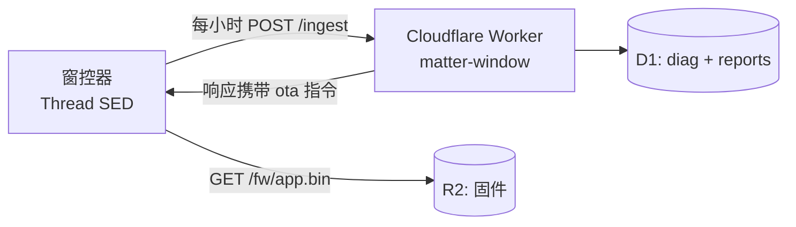

# 遥测上报 + 远程 OTA

设备定期把 diag 环增量和电池状态经 **Thread → HomePod 边界路由器 → 公网** 上报到
Cloudflare Worker；上报响应可携带 OTA 指令，设备用 `esp_https_ota` 拉新固件。
**不开 Wi-Fi**，全程走 Thread（NAT64/DNS64 或原生 IPv6）。

- 固件端：`main/telemetry.cpp`（每小时一报，失败静默重试；NVS 记"已上报到 seq"）
- 服务端：`tools/telemetry-worker/`（D1 存日志，R2 存固件）
- 凭据：`main/telemetry_secrets.h`（gitignore，模板见 `.example`）；Worker 侧 `wrangler secret put API_TOKEN`



## 日常查看

```bash
TOKEN=<token>   # 与 telemetry_secrets.h 相同
BASE=https://matter-window.esonwong.com

curl -s "$BASE/reports?hours=48" -H "Authorization: Bearer $TOKEN"   # 心跳 + vbat 曲线
curl -s "$BASE/logs?hours=24"    -H "Authorization: Bearer $TOKEN"   # diag 事件
curl -s "$BASE/logs?hours=72&type=2" -H "Authorization: Bearer $TOKEN"  # 只看 HOURLY
```

## 发布 OTA

```bash
source ./env.sh && idf.py build
cd tools/telemetry-worker
VER=$(grep -a -m1 -o 'v[0-9.]*' ../../build/matter-window.bin | head -1)  # 或手工指定
SHA=$(shasum -a 256 ../../build/matter-window.bin | cut -d' ' -f1)
npx wrangler r2 object put matter-window-fw/app.bin --file ../../build/matter-window.bin --remote
curl -s -X POST "$BASE/fw/publish" -H "Authorization: Bearer $TOKEN" \
  -H 'Content-Type: application/json' -d "{\"version\":\"$VER\",\"sha256\":\"$SHA\"}"
```

设备下次上报（≤1 小时）时看到版本号与自身不同就拉取升级。
`POST /fw/clear` 停止推送。**版本号**取自 `esp_app_desc` 的 `version`
（即 git describe / `CMakeLists.txt` project 版本），发布前确认 `fw` 字段与目标不同。

## 关键机制

- **增量上报**：`diag_log` 加了单调 `seq`（NVS 持久化），`telemetry` 记住"已上报到哪"，
  断网多久都不丢（环容量 256 条以内）
- **OTA 安全**：HTTPS + cert bundle；`BOOTLOADER_APP_ROLLBACK_ENABLE` —— 新固件启动
  跑到 `app_main` 末尾自动 mark-valid，起不来则下次重启自动回滚旧槽
- **分区**：2026-08-21 起 `partitions.csv` 为双 OTA 槽（ota_0/ota_1 各 1.9375 MB）。
  **从旧单 factory 布局迁移必须整片擦除**（`idf.py erase-flash flash`），配对、diag、校准全清，
  需重新配对 + 三击校准
- **DNS64**：`CONFIG_OPENTHREAD_DNS64_CLIENT` 依赖 lwIP IPv4，故 `CONFIG_DISABLE_IPV4=n`。
  家里若有原生 IPv6 则不走 NAT64，两条路都通
- **功耗**：每小时醒 ~2-5 s 发一个 HTTPS 请求，均摊 < 0.1 mA

## 排查

| 现象 | 查 |
|---|---|
| Worker 收不到数据 | 调试固件看 `TELEM` 日志：DNS 解析失败 → 边界路由器 NAT64/IPv6 问题；TLS 失败 → cert bundle |
| OTA 卡住 | Thread 带宽 ~20-50 kbps，1.5 MB 要 5-10 分钟，耐心；失败下轮自动重试 |
| 升级后变砖担忧 | 回滚保护兜底：新固件起不来自动回老版本 |
